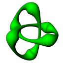

## Message from the author ##

 

- Programmer : Guillaume Saumure
- AKA : StarBootics
- Program : Dev-Object
- Version : 2.0.2
- Plateform : Windows, Linux (Tested on Debian 11)
- Creation date : October 27^th^, 2019
- Last Update : March 9^th^, 2023
- Created with : PureBasic V6.01 LTS

---

## Licence and Conditions  ##

 

This software is distributed as is without warranty and its use is at your own risk. Moreover, by using it you accept all the conditions below : 

1. This notice should never be removed or altered if the software is re-distributed.
2. This software must not **UNDER ANY PRETEXT** be sold or included in a commercial distribution.
3. You may use this software for personal or commercial purposes.
4. The author will in no way be held responsible for any use or misuse of this software.
5. The author will in no way be held responsible for the loss of data or any other damage on your computer.

---

## Thanks ##

- Fred and his entire team for PureBasic, without which this project would not exist.
- Thorsten Hoeppner for the MarkDown gadget.
- Neil Hodgson for the Scintilla gadget.

Good programming !!!

Guillaume Saumure  
AKA StarBootics

<gsaumure@gmail.com>
 
---

This document was last modified on March 9^th^, 2023 at 18h51 by Guillaume Saumure. 

